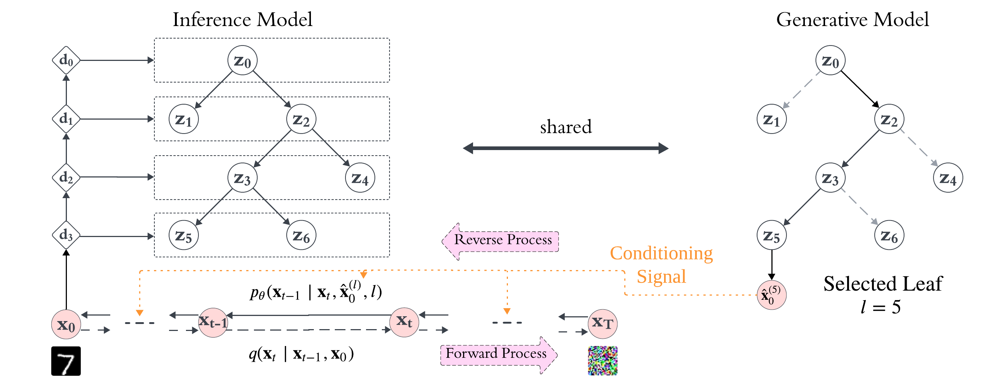
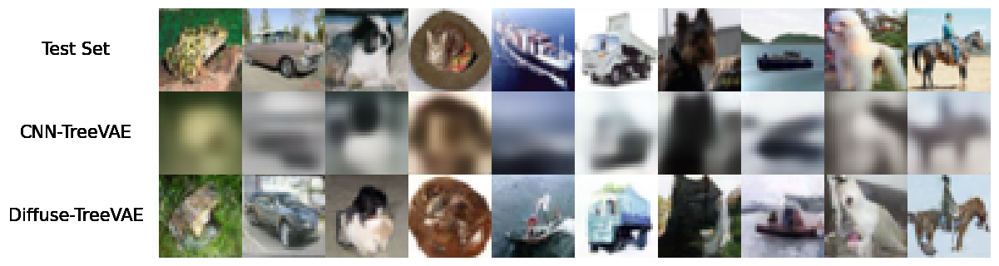
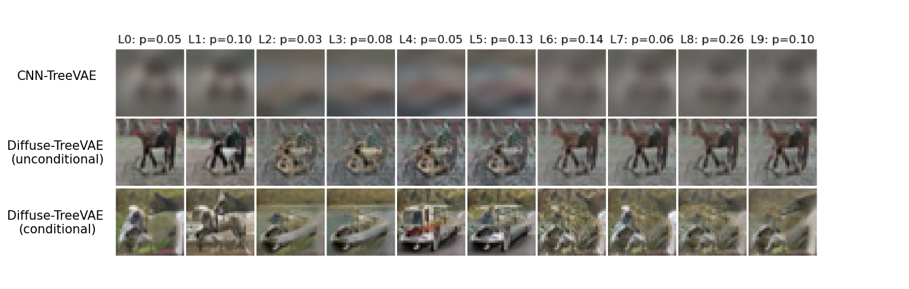

# Structured Generations: Using Hierarchical Clusters to guide Diffusion Models


This repository contains the implementation of **CNN-TreeVAE** and **Diffuse-TreeVAE** from the [Structured Generations: Using Hierarchical Clusters to guide Diffusion Models](https://arxiv.org/abs/2407.06124) paper by Jorge da Silva Goncalves, Laura Manduchi, Moritz Vandenhirtz, and Julia E. Vogt.

---


### CNN-TreeVAE


**CNN-TreeVAE** is an enhanced version of the [TreeVAE implementation](https://github.com/lauramanduchi/treevae) by [Manduchi et. al. (2023)](https://neurips.cc/virtual/2023/poster/71188), designed to improve the generative capabilities and the hierarchical clustering performance of the original model. This is achieved by integrating convolutional neural networks (CNNs) and residual connections. TreeVAE constructs a binary tree where each node represents a latent variable influenced by its parent nodes, and samples probabilistically traverse to leaf nodes representing data clusters. Our CNN-TreeVAE adaptation maintains spatial information and utilizes lower-dimensional representations, resulting in more efficient learning and more flexible data representation. Despite the typical VAE issue of producing blurry images, the model's reconstructed images and learned clustering remain meaningful, serving as a robust foundation for our Diffuse-TreeVAE framework.

### Diffuse-TreeVAE

**Diffuse-TreeVAE** is a deep generative model that integrates hierarchical clustering into the framework of Denoising Diffusion Probabilistic Models (DDPMs) [(Ho et al., 2020)](https://proceedings.neurips.cc/paper/2020/file/4c5bcfec8584af0d967f1ab10179ca4b-Paper.pdf).
The proposed approach generates new images by sampling from CNN-TreeVAE, and utilizes a second-stage DDPM to refine and generate distinct, high-quality images for each data cluster. This is achieved using an adapted version of the [DiffuseVAE framework](https://github.com/JoGo175/DiffuseVAE/tree/main) by [Pandey et. al. (2022)](https://arxiv.org/abs/2201.00308). The result is a model that not only improves image clarity but also ensures that the generated samples are representative of their respective clusters, addressing the limitations of previous VAE-based methods and advancing the state of clustering-based generative modeling. The following figure illustrates the architecture and workflow of Diffuse-TreeVAE.




## Setting up the Dependencies

```
conda env create --name envname --file=treevae.yml
conda activate envname
```

## Supported Datasets

Currently, the code supports the following datasets: 

- MNIST (`"mnist"`)
- FashionMNIST (`"fmnist"`)
- CIFAR-10 (`"cifar10"`)


## CNN-TreeVAE Training 

To train and evaluate the CNN-TreeVAE model, you can use the `main.py` script. Follow the steps below to configure and run your training session.


### Model Training

The recommended approach is to modify the appropriate `.yml` file in the `configs` folder to set up your configurations. Once you've updated the configuration file, run the following command for the desired dataset:
```
python main.py --config_name "cifar10"
```


### Image Generation

Given a trained and saved CNN-TreeVAE model on a given dataset, you can use the following command to generate the 10,000 reconstructions of the testset (mode = `"vae_recons"`) or create 10,000 newly generated images (mode = `"vae_samples"`) for each leaf in the tree. In the following command, `"/20240307-195731_9e95e"` denotes the folder in the `"models/experiments/{dataset}"` directory for the trained CNN-TreeVAE instance. However, the specific folder name will be different for each trained model instance.
```
python vae_generations.py --config_name "cifar10" --seed 1 --mode "vae_recons" --model_name "/20240307-195731_9e95e"
```


## Diffuse-TreeVAE Training

Given a trained and saved CNN-TreeVAE model, you can train the conditional second-stage DDPM for the Diffuse-TreeVAE model using the `train_ddpm.py` script. 

### Model Training

The recommended approach is to modify the appropriate `.yml` file in the `configs` folder to set up your configurations. In particular, make sure to update the paths, such as the directory to the folder of the pre-trained CNN-TreeVAE model on which the DDPM is conditioned (`vae_chkpt_path`), the results directory (`results_dir`). Once you've updated the configuration file, run the following command for the desired dataset:
```
python train_ddpm.py --config_name "cifar10"
```

### Image Generation


To retrieve the reconstructions or samples from the diffusion model, further adjust the appropriate `.yml` file in the `configs` script with the corresponding paths to the trained DDPM model (`chkpt_path`). You can use the following command to generate the 10,000 reconstructions of the testset for the most probable leaf (eval_mode = `"recons"`) or for all leaves (eval_mode = `"recons_all_leaves"`). Furhtermore, you can create 10,000 newly generated images for the most probable leaf (eval_mode = `"sample"`) or for all leaves (eval_mode = `"sample_all_leaves"`). 
```
python test_ddpm.py --config_name $dataset --seed $seed --eval_mode "sample"
```


## Results

Below, we present some key results achieved using the CNN-TreeVAE and Diffuse-TreeVAE models.


### Reconstruction Quality

We compare the reconstruction quality of test set images between the CNN-TreeVAE and Diffuse-TreeVAE models. The Diffuse-TreeVAE model generates images of higher quality and with a distribution closer to the original data distribution.




### Leaf-specific Generations

The TreeVAE model can generate leaf-specific images, where each leaf represents a cluster. The image below showcases randomly generated images from a Diffuse-TreeVAE model trained on CIFAR-10.

To evaluate the quality of the generated images, we trained a classifier on the original dataset and used it to classify the newly generated images from our Diffuse-TreeVAE, analyzing each cluster separately. Ideally, most images from a cluster should be classified into one or very few classes from the original dataset, indicating "pure" or "unambiguous" generations. The normalized histograms below the leaf-specific generated images show the distribution of predicted classes for these new images.


For the classifier, we utilize a ResNet-50 model [(He et al., 2016)](https://www.cv-foundation.org/openaccess/content_cvpr_2016/papers/He_Deep_Residual_Learning_CVPR_2016_paper.pdf) trained on each dataset. The pre-trained classifiers are included in this repo under the `"classifier_pretraining"` directory. If you want to retrain the models yourself, you can run the following command: 
```
python classifier_pretraining/clf_training.py --data_name "cifar10"
```


### Cluster-conditioning in Diffuse-TreeVAE


The following image compares two Diffuse-TreeVAE models: one conditioned only on reconstructions and the other on both reconstructions and the leaf index. Both models were trained using the same underlying CNN-TreeVAE. The picture shows the image generations from each leaf of the CNN-TreeVAE, the cluster-unconditional Diffuse-TreeVAE, and the cluster-conditional Diffuse-TreeVAE, all trained on CIFAR-10. Each row displays the generated images from all leaves of the specified model, starting with the same sample from the root. The corresponding leaf probabilities are shown at the top of the image and are by design the same for all models.



The results show that while both models improve image quality, the cluster-conditional model produces more diverse images, better adapting to each cluster. These images exhibit features from multiple CIFAR-10 classes, such as horses, ships, and cars, indicating a higher level of detail and variety. 


# References

[He, K., Zhang, X., Ren, S., and Sun, J. Deep Residual Learning for Image Recognition. In *2016 IEEE Conference on Computer Vision and Pattern Recognition (CVPR)*, pp. 770–778, June 2016. doi:10.1109/CVPR.2016.90. ISSN:1063-6919.](https://www.cv-foundation.org/openaccess/content_cvpr_2016/papers/He_Deep_Residual_Learning_CVPR_2016_paper.pdf)

[Ho, J., Jain, A., and Abbeel, P. Denoising Diffusion Probabilistic Models. In *Advances in Neural Information Processing Systems*, volume 33, pp. 6840–6851. Curran Associates, Inc., 2020.](https://proceedings.neurips.cc/paper/2020/file/4c5bcfec8584af0d967f1ab10179ca4b-Paper.pdf)

[Manduchi, L., Vandenhirtz, M., Ryser, A., and Vogt, J. Tree Variational Autoencoders. In *Advances in Neural Information Processing Systems*, volume 36, December 2023.](https://neurips.cc/virtual/2023/poster/71188)

[Pandey, K., Mukherjee, A., Rai, P., and Kumar, A. DiffuseVAE: Efficient, Controllable and High-Fidelity Generation from Low-Dimensional Latents. *Transactions on Machine Learning Research*, August 2022. ISSN 2835-8856.](https://arxiv.org/abs/2201.00308)


# BibTex

```
@misc{goncalves2024structuredgenerationsusinghierarchical,
      title={Structured Generations: Using Hierarchical Clusters to guide Diffusion Models}, 
      author={Jorge da Silva Goncalves and Laura Manduchi and Moritz Vandenhirtz and Julia E. Vogt},
      year={2024},
      eprint={2407.06124},
      archivePrefix={arXiv},
      primaryClass={cs.LG},
      url={https://arxiv.org/abs/2407.06124}, 
}
```
